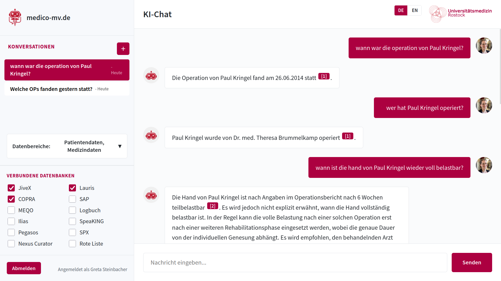
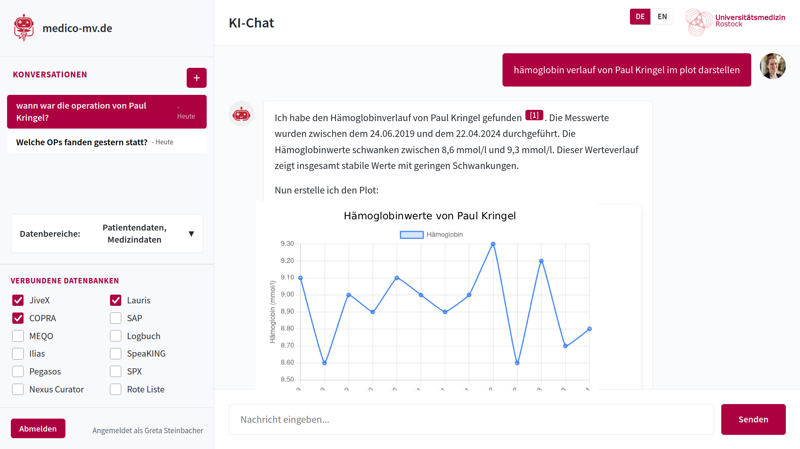

# Medico-MV

Hospitals are full of data — patient records, lab results, surgical reports, administrative systems — spread across dozens of applications that barely talk to each other. Getting to the right information means too many clicks, too many context switches, and too little time. This is a problem for every role in healthcare, from the ER doctor to the logistics department.

Medico-MV is a chat interface that sits on top of these data sources. You ask questions in plain language — about a patient's history, their medication, whether an old implant is MRI-safe — and it pulls together answers from the available documents, with citations back to the source. It runs entirely on local infrastructure: local LLMs, local servers, no patient data leaving the network.

Built in 48 hours by a two-person team at the [Healthcare Hackathon MV 2025](https://www.healthcarehackathon-mv.de/#challenges), Universitätsmedizin Rostock, where it won the 700€ prize for "Implementation and Feasibility".





*Names in the screenshots have been anonymized.*

This prototype demonstrates the concept using a RAG pipeline over medical PDFs (discharge letters, lab reports, surgical notes).

## What it does

- Streaming chat over WebSockets with an OpenAI-compatible LLM backend
- RAG: index PDFs/DOCX/TXT, search them with sentence-transformers + Qdrant, inject context into prompts
- Tool calling (e.g. Chart.js plots from data in documents)
- JWT auth, or anonymous browser sessions (`DISABLE_LOGIN=true`)
- Citations with inline references and a built-in PDF viewer

## Running it

Needs Python 3.11+ and [uv](https://github.com/astral-sh/uv).

### Chat app

```bash
cd ai-chat-app
uv sync
cp .env.example .env  # fill in your LLM endpoint + API key
uv run python main.py # http://localhost:8000
```

Default login: `admin` / `password`

### RAG service (optional)

```bash
cd rag-service
uv sync --all-extras
cp .env.example .env  # set CUDA_DEVICE=cpu if no GPU
uv run python main.py # http://localhost:8001
```

Index documents:

```bash
uv run python cli.py index /path/to/docs --recursive
uv run python cli.py search "some query"
```

Point the chat app at the RAG service by setting `RAG_SERVICE_URL=http://localhost:8001` in `ai-chat-app/.env`.

## Configuration

Both services are configured via `.env` files — see `.env.example` in each directory.

Key variables for the chat app:

| Variable | Description |
|---|---|
| `LLM_BASE_URL` | OpenAI-compatible API endpoint |
| `LLM_API_KEY` | API key |
| `LLM_MODEL_NAME` | Model to use |
| `SECRET_KEY` | JWT secret (`openssl rand -hex 32`) |
| `DISABLE_LOGIN` | `true` for anonymous sessions |
| `RAG_SERVICE_URL` | URL of the RAG service (optional) |

## Project structure

```
ai-chat-app/
├── app/
│   ├── models/      # SQLAlchemy models
│   ├── routes/      # API + WebSocket endpoints
│   └── services/    # Auth, LLM, RAG client, tools
├── templates/       # Single-page frontend
└── main.py

rag-service/
├── embedder.py      # sentence-transformers
├── vector_store.py  # Qdrant
├── parsers.py       # PDF/DOCX/TXT parsing
├── cli.py           # CLI for bulk indexing
└── main.py
```
